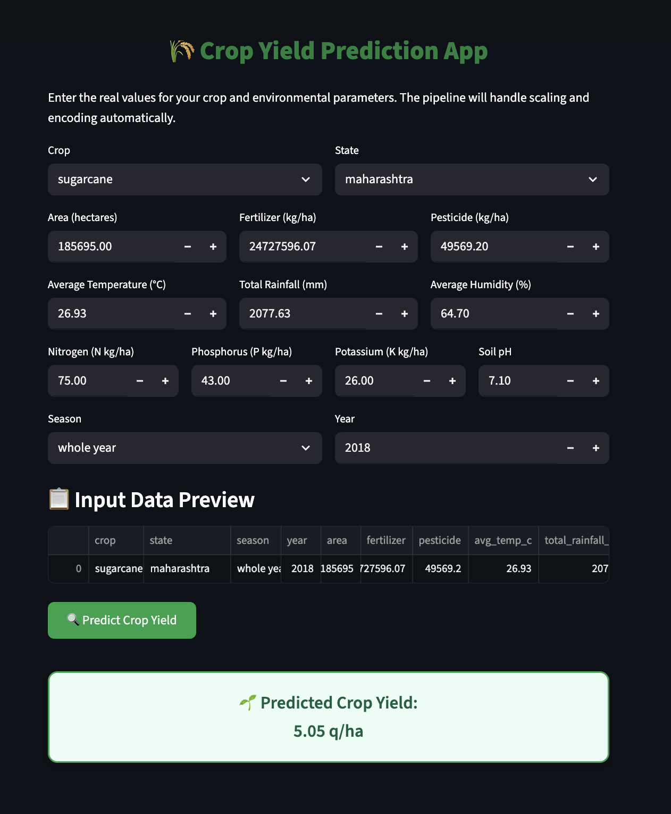

# Forecasting State-Wise Crop Yield in India

## Project Overview
This project aims to forecast crop yields for major crops (rice, wheat, sugarcane, maize) across Indian states using regression models (Linear Regression, XGBoost, LSTM). It leverages historical data on crop yield, area, production, soil, and weather to inform agricultural planning and policy decisions.

---

## Folder Structure & File Grouping

### 1. Data Files
- **crop_yield.csv**: Crop-wise yield, area, production, fertilizer, pesticide, rainfall, season, and state (1997–2020).
- **state_soil_data.csv**: State-wise soil nutrients (N, P, K) and pH.
- **state_weather_data_1997_2020.csv**: State-wise annual weather (temperature, rainfall, humidity).
- **final_merged_statewise_crop_yeild_dataset.csv**: Merged dataset combining crop, soil, and weather data for modeling.
- **final_merged_statewise_crop_yeild_dataset.xlsx**: Excel version of the merged dataset.
- **cleaned_crop_data.xlsx**: Cleaned and preprocessed dataset after outlier handling and normalization.

### 2. Notebooks
- **Forecasting State-Wise Crop Yield in India_Final.ipynb**: Main analysis notebook. Covers:
  - Data loading, merging, and cleaning
  - Exploratory Data Analysis (EDA)
  - Feature engineering and normalization
  - Model building (Linear Regression, Random Forest, XGBoost, etc.)
  - Model evaluation and feature importance
  - Dashboard generation (HTML)

### 3. Python Apps & Models
- **XGBoost_App.py**: Streamlit app for interactive crop yield prediction using the trained XGBoost model.
- **best_model_XGBoost.pkl**: Serialized pipeline for XGBoost regression (used by the app).

### 4. Dashboards & Visualizations
- **state_season_crop_dashboard.html**: Interactive dashboard (state-wise seasonal yield and top crops).
- **bivariate_analysis_dashboard.html**: Dashboard for bivariate analysis (yield vs. rainfall, temperature, humidity, soil nutrients, crop diversity).
- **Flow_Chart_Data_Merge.png**: Visual flowchart showing how datasets are merged.

---

## How to Run the XGBoost Streamlit App

### 1. Install Dependencies
Make sure you have Python 3.8+ and the required packages:

```zsh
pip install streamlit scikit-learn pandas xgboost
```

### 2. Run the App
From the project folder, run:

```zsh
streamlit run XGBoost_App.py
```

The app will open in your browser. Enter crop, state, season, year, and environmental parameters to get yield predictions.

#### Crop Yield Prediction App Screenshot




---

## Notes
- All data files should be in the same folder as the scripts for seamless execution.
- The app uses the trained XGBoost pipeline (`best_model_XGBoost.pkl`).
- For more details, see the notebook for step-by-step analysis and modeling.
